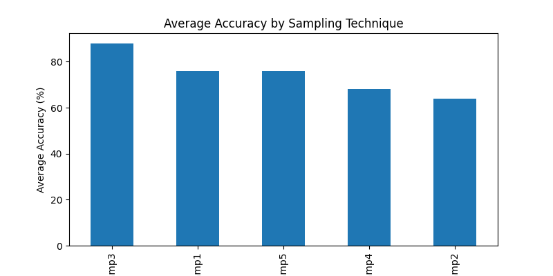

# Assignment 2 : Sampling

---

## 📌 Assignment Overview

This assignment focuses on detecting fraudulent credit card transactions using multiple machine learning models combined with different sampling techniques.
Since credit card fraud datasets are highly imbalanced, this project evaluates how different sampling methods affect model performance.

The goal is to:

- Handle class imbalance
- Apply multiple sampling techniques
- Train different machine learning models
- Compare performance using accuracy
- Identify the best model and sampling technique combination

---

## Dataset

**File Used:** `Creditcard_data.csv`
link : https://github.com/AnjulaMehto/Sampling_Assignment/blob/main/Creditcard_data.csv

- Total Records: **772**
- Total Features: **30 input features + 1 target column**
- Target Column: **Class**

### Class Distribution (Original Dataset):

| Class | Description | Count |
|-------|------------|--------|
| 0 | Non-Fraud | 763 |
| 1 | Fraud | 9 |

---

## ⚙️ Methodology

### Data Balancing

Since only 9 fraud cases exist, random undersampling is applied:

- Majority class (0) is reduced
- Minority class (1) retained fully
- Final balanced dataset:

| Class | Count |
|--------|--------|
| 0 | 9 |
| 1 | 9 |

Total balanced dataset size = **18 samples**

---

### Sampling Techniques Applied

Five sampling techniques were implemented:

| Sampling | Method |
|-----------|--------|
| Samp1 | Simple Random Sampling (80%) |
| Samp2 | Systematic Sampling |
| Samp3 | Stratified Sampling |
| Samp4 | Bootstrap Sampling |
| Samp5 | Cluster Sampling |

---

## Sample Sizes & Class Distribution

### Samp1 – Simple Random
Shape: **(14, 31)**

| Class | Count |
|--------|--------|
| 1 | 8 |
| 0 | 6 |

---

### Samp2 – Systematic
Shape: **(9, 31)**

| Class | Count |
|--------|--------|
| 1 | 5 |
| 0 | 4 |

---

### Samp3 – Stratified
Shape: **(15, 31)**

| Class | Count |
|--------|--------|
| 0 | 8 |
| 1 | 7 |

---

### Samp4 – Bootstrap
Shape: **(18, 31)**

| Class | Count |
|--------|--------|
| 0 | 12 |
| 1 | 6 |

---

### Samp5 – Cluster
Shape: **(10, 31)**

| Class | Count |
|--------|--------|
| 1 | 6 |
| 0 | 4 |

---

## Train-Test Split

Balanced dataset was split into:

- 75% Training
- 25% Testing (Holdout Set)

### Holdout Test Set Details

- Shape: **(5, 30)**
- Class Distribution:

| Class | Count |
|--------|--------|
| 0 | 3 |
| 1 | 2 |

The holdout set remains fixed for fair evaluation.

---

## Machine Learning Models Used

| Model | Description |
|--------|------------|
| Logistic Regression | Linear classifier |
| Random Forest | Ensemble tree-based model |
| KMeans | Unsupervised clustering |
| SVC | Support Vector Classifier (RBF Kernel) |
| C4.5 | Decision Tree (Entropy criterion) |

---

## Accuracy Results (%)

| Model ↓ | Samp1 | Samp2 | Samp3 | Samp4 | Samp5 |
|----------|-------|-------|-------|-------|-------|
| LogisticRegression | 80.0 | 40.0 | 100.0 | 40.0 | 80.0 |
| RandomForest | 80.0 | 80.0 | 100.0 | 80.0 | 100.0 |
| KMeans | 60.0 | 60.0 | 60.0 | 80.0 | 20.0 |
| SVC | 80.0 | 60.0 | 80.0 | 60.0 | 80.0 |
| C4.5 | 80.0 | 80.0 | 100.0 | 80.0 | 100.0 |

---

## Best Sampling Technique per Model

| Model | Best Sampling | Best Accuracy (%) |
|--------|---------------|------------------|
| LogisticRegression | Samp3 | 100.0 |
| RandomForest | Samp3 | 100.0 |
| C4.5 | Samp3 | 100.0 |
| KMeans | Samp4 | 80.0 |
| SVC | Samp1 | 80.0 |

---

## Best Overall Combination

```
Best overall: LogisticRegression with Samp3 => 100.00%
```

---

## Result Visualization

A bar graph is generated showing:


- X-axis → Sampling Techniques
- Y-axis → Average Accuracy (%)
- Bars represent mean accuracy across all models

From the graph, **Samp3 (Stratified Sampling)** shows the best overall performance.

---

## Key Observations

- Stratified Sampling (Samp3) performs best overall.
- Logistic Regression, Random Forest, and C4.5 achieved 100% accuracy using Samp3.
- KMeans performs inconsistently since it is unsupervised.
- Sampling technique significantly affects model performance.
- Very small dataset size may inflate accuracy scores.

---

## Limitations

- Balanced dataset contains only 18 samples.
- Holdout test set contains only 5 samples.
- Accuracy may not fully represent real-world performance.
- Precision, Recall, and F1-score would be better metrics for fraud detection.

---

## Conclusion

This project demonstrates:

- The importance of handling extreme class imbalance.
- The effect of different sampling techniques on model accuracy.
- The importance of choosing the right model and sampling strategy.

The best-performing combination is:

**Logistic Regression with Stratified Sampling (100% Accuracy)**

---

## Technologies Used

- Python
- NumPy
- Pandas
- Scikit-learn
- Matplotlib

---

## How to Run

1. Place `Creditcard_data.csv` in the project directory.
2. Install required libraries:

```
pip install numpy pandas scikit-learn matplotlib
```

3. Run the Python script.

---

## Author

Aartha Singh 

---
